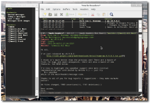

# Welcome to mu!

With the *enormous* amounts of e-mail many people gather and the
importance of e-mail messages in our daily work-flow, it is very
important to be able to quickly deal with all that - in particular,
to instantly find that one important e-mail you need right now.

For that, *mu* was created.  *mu* is a tool for dealing with e-mail
messages stored in the
[Maildir](http://en.wikipedia.org/wiki/Maildir)-format, on Unix-like
systems. *mu*'s main purpose is to help you to find the messages you
need, quickly; in addition, it allows you to view messages, extract
attachments, create new maildirs, ... See the
[mu cheatsheet](cheatsheet.html) for some examples. Mu's source code
is available [in github](https://github.com/djcb/mu), and there is the
[mu-discuss](http://groups.google.com/group/mu-discuss) mailing list.

*mu* includes an emacs-based e-mail client (`mu4e`), a simple GUI
(`mug`) and bindings for the Guile/Scheme programming language.

## Features

- fast indexing for [Maildir](http://en.wikipedia.org/wiki/Maildir), Maildir+ and Maildir-on-VFAT
- search for messages based on the sender, receiver, subject, date-range,
size, priority, words in message, flags (signed, encrypted, new, replied,
has-attachment,...), message-id, maildir, tags, attachment (name,
mime-type, text) and more
- support for encrypted and signed messages
- command-line tools for indexing, searching, viewing, adding/removing
messages, extracting attachments, exporting/searching address lists,
creating maildirs, ...
- accent/case normalization - so *angstrom* matches *Ångström*
- can be integrated with other e-mail clients such as
[mutt](http://www.mutt.org/) and
[Wanderlust](http://www.emacswiki.org/emacs/WanderLust).
- [mu4e](mu4e.html), an emacs-based e-mail client based on `mu` (see screenshot).
- [mu-guile](mu-guile.html):
[guile 2.0](http://www.gnu.org/software/guile/) bindings that
allow for scripting, advanced processing of your data, and doing
all kinds of statistics
- fully documented (man pages, info pages)

## News

2015-09-24: After almost 6 months, a new release of mu/mu4e. We are
happy to announce mu and mu4e 0.9.9.13! have just been
released. The following key features and improvements have been
added:

* Change the way the headers are displayed and sorted
* Fancy characters now enabled distinctively both for marks and
headers
* Composing a message is now possible in a separate frame
* Ability to display the subject of a thread only on top of it for
enhanced clarity
* Lots of bugs squashed, updates to the documentation (BDDB), as
well as embedding the News file inside mu4e itself.

You may grab the the tarball [from GitHub](https://github.com/djcb/mu-releases/) or get it through your
distribution channels (details may vary from one distribution to
another).

None of this would be possible without a team of dedicated
individuals: Attila, Charles-H.Schulz, David C Sterrat, Dirk-Jan
C. Binnema, Eike Kettner, Florian Lindner, Foivos S. Zakkak, Gour,
KOMURA Takaaki, Pan Jie, Phil Hagelberg, thdox, Tiago Saboga, Titus
von der Malsburg (and of course all people who reported issues,
provided suggestions etc.)

We hope you will enjoy this release as much as we do. Happy Hacking!

The mu/mu4e Team

## Old News

- 2013-03-30: released [mu-0.9.9.5](http://code.google.com/p/mu0/downloads/detail?name%3Dmu-0.9.9.5.tar.gz); full with new features and bug
fixes – see the download link for some of the details. Many
thanks to all who contributed!
- 2012-10-14: released [mu-0.9.9](http://code.google.com/p/mu0/downloads/detail?name%3Dmu-0.9.9.tar.gz); a new barrage of fixes and
improvements – check the link and [NEWS](https://github.com/djcb/mu/blob/master/NEWS). Also, note the
[mu4e-manual](http://code.google.com/p/mu0/downloads/detail?name%3Dmu4e-manual-0.9.9.pdf) (PDF).
- 2012-07-01: released [mu-0.9.8.5](http://code.google.com/p/mu0/downloads/detail?name%3Dmu-0.9.8.5.tar.gz); more fixes, improvements (see
the link).
- 2012-05-08: released
[mu-0.9.8.4](http://code.google.com/p/mu0/downloads/detail?name%3Dmu-0.9.8.4.tar.gz)
with even more improvements (the link has all the details)
- 2012-04-06: released
[mu-0.9.8.3](http://code.google.com/p/mu0/downloads/detail?name%3Dmu-0.9.8.3.tar.gz),
with many improvements, fixes. See the link for details. *NOTE*:
existing `mu` and `mu4e` users are recommended to execute `mu
index --rebuild` after installation.
- 2012-03-11: released
[mu-0.9.8.2](http://code.google.com/p/mu0/downloads/detail?name=mu-0.9.8.2.tar.gz),
with a number of fixes and improvements, see the link for the
details.
- 2012-02-17: released
[mu-0.9.8.1](http://code.google.com/p/mu0/downloads/detail?name%3Dmu-0.9.8.1.tar.gz),
which has a number of improvements to the 0.9.8 release: add mark
as read/unread, colorize cited message parts, better handling of
text-based message parts, documentation fixes, documentation
updates and a few fixes here and there
- 2012-02-09: moved the mu source code repository
[to Github](https://github.com/djcb/mu).
- 2012-01-31: finally,
[mu-0.9.8](http://mu0.googlecode.com/files/mu-0.9.8.tar.gz) is
available. It comes with an emacs-based e-mail client,
[mu4e](file:mu4e.html), and much improved
[guile bindings](file:mu-guile.html). Furthermore, It adds
search for attachment mime type and search inside any text part
of a message, more tests, improvements in many parts of the code.
- 2011-09-03: mu 0.9.7 is now available; compared to the -pre
version there are a few small changes; the most important one is
a fix specifically for running mu on MacOS.

- [Old news](file:old-news.org)

## Development & download

Some Linux-distributions already provide pre-built mu packages; if
there's no packagage for your distribution, or if you want the
latest release, you can [download mu source packages](http://code.google.com/p/mu0/downloads/list) from Google
Code. In case you find a bug, or have a feature requests, please
use the [issue tracker](https://github.com/djcb/mu/issues).

If you'd like to work with the mu source code, you can find it [in Github](https://github.com/djcb/mu);
also, see the notes on [HACKING](https://github.com/djcb/mu/blob/master/HACKING) the mu source code.

There's also a [mailing list](http://groups.google.com/group/mu-discuss).

## License & Copyright

*mu* was designed and implemented by Dirk-Jan C. Binnema, and is Free
 Software, licensed under the GNU GPLv3
