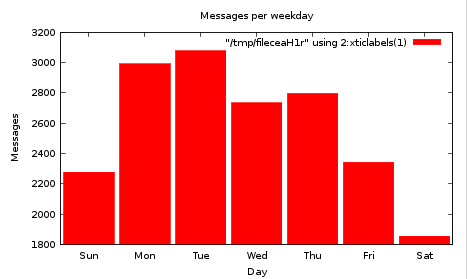

# mu-guile

Starting from version 0.9.7,
[GNU/Guile](http://www.djcbsoftware.nl/code/mu][mu]] had experimental
bindings for the
[[http://www.gnu.org/software/guile/) programming language, which is a version of the [Scheme](http://en.wikipedia.org/wiki/Scheme_(programming_language))
programming language, specifically designed for extending existing
programs.

`mu` version 0.9.8 has much improved bindings, and they are
[documented](file:mu-guile/index.html), with many examples. You can
find more examples in the `guile/examples` directory of the `mu`
source package.

It must be said that Scheme (and in general, languages from the Lisp-family)
initially may look a bit 'strange' -- all these parentheses etc.; so please
bear with us -- you will get used to it.

## Some examples

Here are some examples; we don't provide too much explanation /how/ they do
what they do, but the [manual](file:mu-guile/index.html) takes you through that, step-by-step.

*NOTE (1)*: if you get errors like `ERROR: no code for module (mu)`,
`guile` cannot find the `mu` modules. To solve this, you need to set
the `GUILE_LOAD_PATH` to the directory with the installed `mu.scm`,
e.g.

``` sh
   export GUILE_LOAD_PATH="/usr/local/share/guile/site/2.0"
```

(you need to adapt this if you installed `mu` in some non-standard place; but
it's always the directory with the installed `mu.scm`).

*NOTE (2)*: for the graphs (below) to work, you will need to have the `gnuplot`
program installed.

*NOTE (3)*: the examples below assume that you have your messages indexed
already using `mu`; see the man pages, or the [mu cheat sheet](http://www.djcbsoftware.nl/code/mu/cheatsheet.html).

### Messages per weekday

    #!/bin/sh
    exec guile -s $0 $@
    !#
     
    (use-modules (mu) (mu message) (mu stats) (mu plot))
    (mu:initialize)
     
    ;; create a list like (("Mon" . 13) ("Tue" . 23) ...)
    (define weekday-table
      (mu:weekday-numbers->names
        (sort
          (mu:tabulate-messages
     	(lambda (msg)
     	  (tm:wday (localtime (mu:date msg)))))
          (lambda (a b) (< (car a) (car b))))))
     
    (for-each
      (lambda (elm)
        (format #t "`a: `a\n" (car elm) (cdr elm)))
      weekday-table)

Which outputs something like:


    Sun: 2278
    Mon: 2991
    Tue: 3077
    Wed: 2734
    Thu: 2796
    Fri: 2343
    Sat: 1856

The numbers may be a bit different though... In my case, Saturday
seems a particularly slow day for e-mail.

### Drawing graphs

We can also draw graphs from this, by adding the following to the script:

    ;; plain-text graph
    (mu:plot (weekday-table) "Messages per weekday" "Day" "Messages" #t)
     
    ;; GUI graph
    (mu:plot (weekday-table) "Messages per weekday" "Day" "Messages")


This gives us the following:

### plain text graph
     
                                   Messages per weekday
     Messages
       3200 ++---+--------+---------+--------+---------+---------+--------+---++
            |    +        +     "/tmp/filel8NGRf" using 2:xticlabels(1) ****** |
       3000 ++                  *       *                                     ++
            |         ***********       *                                      |
            |         *        **       *                                      |
       2800 ++        *        **       *          *********                  ++
            |         *        **       ************       *                   |
       2600 ++        *        **       **        **       *                  ++
            |         *        **       **        **       *                   |
            |         *        **       **        **       *                   |
       2400 ++        *        **       **        **       ***********        ++
            ***********        **       **        **       **        *         |
       2200 *+       **        **       **        **       **        *        ++
            *        **        **       **        **       **        *         |
            *        **        **       **        **       **        *         |
       2000 *+       **        **       **        **       **        *        ++
            *    +   **   +    **   +   **   +    **   +   **    +   ***********
       1800 ********************************************************************
                Sun      Mon       Tue      Wed       Thu       Fri      Sat
                                            Day
#### GUI graph



### Export contacts to `mutt`

`mu` provides `mu cfind` to get contact information from the database;
it's fast, since it uses cached contact data. But sometimes, we may
want to get a bit more advanced. For examples, suppose I want a list
of names and e-mail addresses of people that were seen at least 20
times since 2010, in the `mutt` address book format.

We could get such a list with something like the following:

       !/bin/sh
       exec guile -s $0 $@
       !#
        
       (use-modules (mu) (mu message) (mu contact))
       (mu:initialize)
        
       ;; Get a list of contacts that were seen at least 20 times since 2010
       (define (selected-contacts)
         (let  ((addrs '())
        	  (start (car (mktime (car (strptime "%F" "2010-01-01")))))
        	  (minfreq 20))
           (mu:for-each-contact
             (lambda (contact)
        	(if (and (mu:email contact)
        	      (>= (mu:frequency contact) minfreq)
        	      (>= (mu:last-seen contact) start))
        	  (set! addrs (cons contact addrs)))))
             addrs))
        
       (for-each
         (lambda (contact)
           (format #t "~a\n" (mu:contact->string contact "mutt-alias")))
         (selected-contacts))


## License & Copyright

*mu-guile* was designed and implemented by Dirk-Jan C. Binnema, and is
Free Software, licensed under the GNU GPLv3
