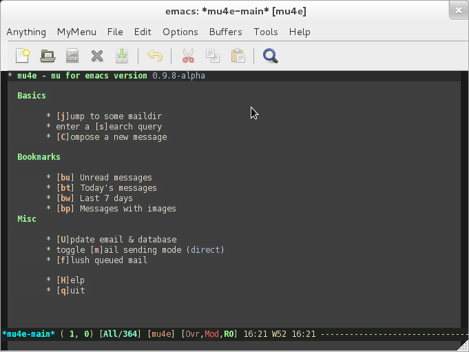
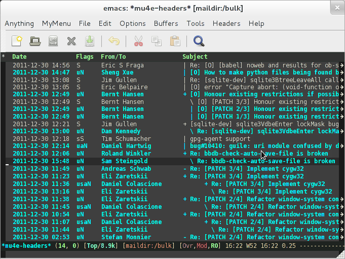
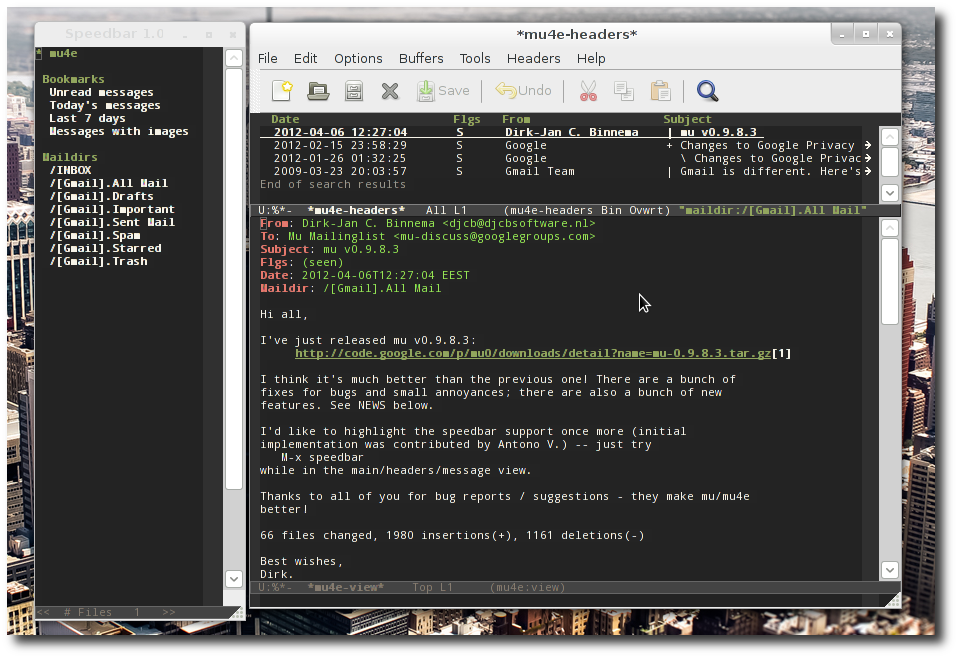
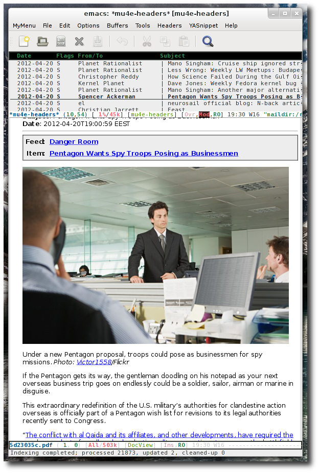

Starting with version 0.9.8, [mu](http://www.djcbsoftware.nl/code/mu)
provides an emacs-based e-mail client which uses `mu` as its back-end:
*mu4e*.

Through `mu`, `mu4e` sits on top of your Maildir (which you update
with e.g. `offlineimap` or `fetchmail`). `mu4e` is designed to enable
super-efficient handling of e-mail; searching, reading, replying,
moving, deleting. The overall 'feel' is a bit of a mix of `dired` and
[Wanderlust](http://www.gohome.org/wl/).

Features include:

   - Fully search-based: there are no folders, only queries
   - UI optimized for speed with quick key strokes for common actions
   - Fully documented, with example configurations
   - Asynchronous: heavy actions never block emacs
   - Write rich-text e-mails using /org-mode/ (experimental)
   - Address auto-completion based on your messages -- no need for
     managing address books
   - Extendable in many places using custom actions

For all the details, please see the [manual](mu4e/), or
check the screenshots below. `mu4e` is part of the normal
[mu source package](http://code.google.com/p/mu0/downloads/list) and
also [[https://github.com/djcb/mu][available on Github]].

# Screenshots

## The main view

## The headers view

## The message view

## The message/headers split view (0.9.8.4)

The message/headers split view, and speedbar support.

## View message as pdf (0.9.8.4)

## License & Copyright

*mu4e* was designed and implemented by Dirk-Jan C. Binnema, and is
Free Software, licensed under the GNU GPLv3
